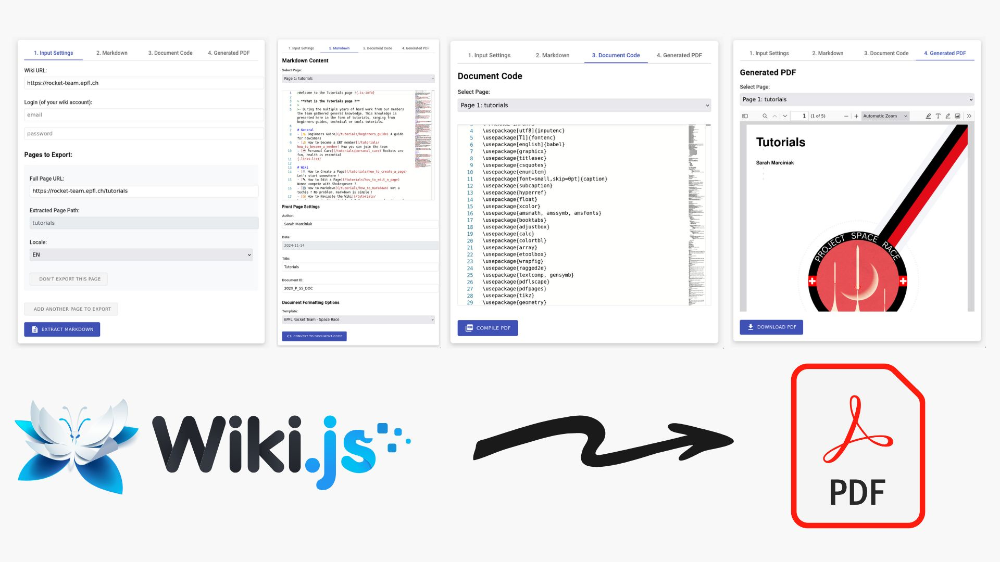

# wiki-to-pdf-docker
Webapp to convert wiki.js pages into pdf pages, with custom styling and options. Works out of the box with Docker.



## Go-only Quickstart

This repository now runs in Go-only mode for the app/API runtime.

### Start with Docker

```sh
docker compose up -d --build web-go redis
```

App/API endpoint:

- http://127.0.0.1:8000

### Start locally (Go) + Redis in Docker

```sh
./scripts/run_hybrid_local.sh
```

### Run smoke checks

```sh
./scripts/run_compare_contract.sh
```

Artifacts are written to `artifacts/`.
